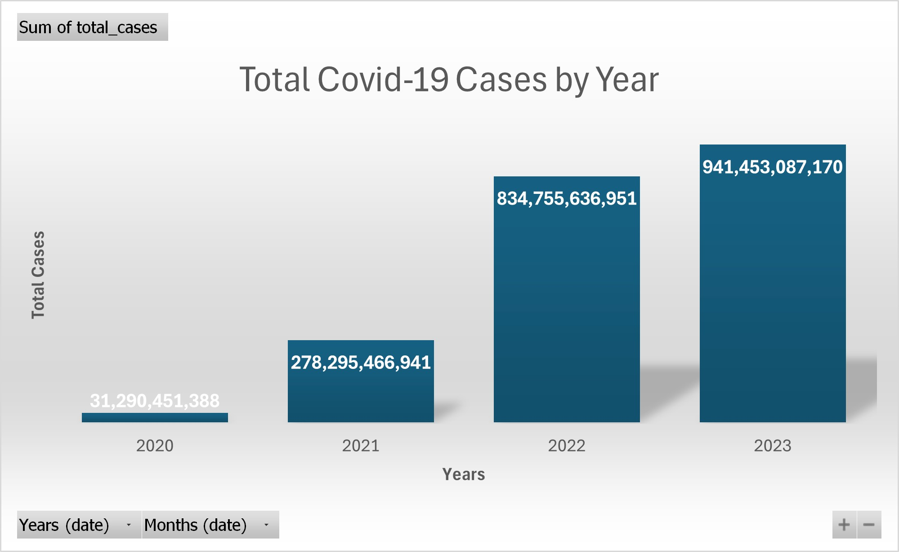

# Excel_Covid_Project
Covid-19 dataset cleaned and visualized using Excel (Pivot charts).
# Covid-19 Data Analysis with Excel  

This project focuses on **cleaning and visualizing Covid-19 dataset** using **Excel Pivot Tables and Charts**.  

## 📊 Project Steps  
1. **Data Cleaning**  
   - Removed unnecessary columns and rows  
   - Handled missing values  
   - Saved cleaned dataset for analysis  

2. **Data Visualization**  
   - **Bar Chart**: Total Covid-19 cases by year (2020–2023)  
   - **Pie Chart**: Distribution of Covid-19 cases by continent  

## 📁 Files  
- `Covid-19 Cleaned data.xlsx` → Cleaned dataset with pivot charts  
- `README.md` → Project description  

## 🛠️ Tools Used  
- Microsoft Excel (Pivot Table, Pivot Chart)  
- GitHub (Version control and portfolio)  

## 📸 Sample Visualizations  
*(Add screenshots of your charts here — optional but highly recommended for portfolio)*  

## ✨ Key Insights  
- Covid-19 cases peaked in 2022 and 2023  
- Europe and North America reported the highest total cases

- ## 📊 Sample Visualizations

### Covid-19 Cases by Year

- Oceania had the lowest number of cases among all continents  

---

👤 **Author**: Rashid  
🎯 *This project is part of my Data Analytics portfolio.*
