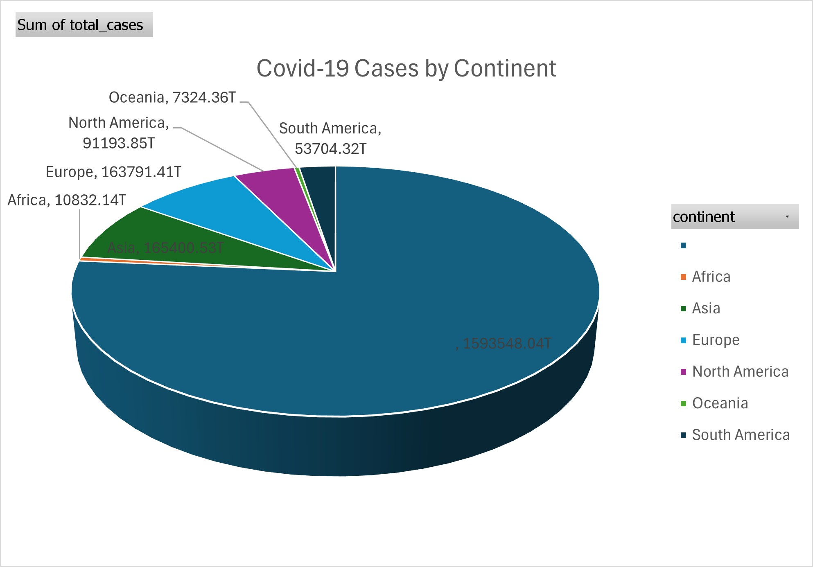

# 📌 Excel_Covid_Project  

Covid-19 dataset cleaned and visualized using **Excel (Pivot Tables & Pivot Charts)**.  

---

## 🎯 Project Overview  
This project focuses on **cleaning and visualizing Covid-19 dataset** using Excel.  
The goal was to remove unnecessary data, handle missing values, and create meaningful visualizations.  

---

## 📝 Project Steps  

### 1️⃣ Data Cleaning  
- Removed unnecessary columns and rows  
- Handled missing values  
- Saved cleaned dataset for further analysis  

### 2️⃣ Data Visualization  
- **Bar Chart:** Total Covid-19 cases by year (2020–2023)  
- **Pie Chart:** Distribution of Covid-19 cases by continent  

---

## 📂 Files in Repository  
- `Covid-19 Cleaned data.xlsx` → Cleaned dataset with pivot charts  
- `README.md` → Project documentation  

---

## 🛠 Tools Used  
- Microsoft Excel (Pivot Table, Pivot Chart)  
- GitHub (Version control and portfolio)  

---

## 📊 Sample Visualizations  

### Covid-19 Cases by Year  
  
📌 *Observation:* Covid-19 cases increased rapidly, peaking in **2022 and 2023**.  

### Covid-19 Cases by Continent  
  
📌 *Observation:* **Asia** recorded the highest number of cases, followed by **Europe** and **North America**.  

---

## ✨ Key Insights  
- Covid-19 cases peaked in **2022–2023**  
- **Asia, Europe, and North America** had the highest number of reported cases  
- Data cleaning helped remove noise and improved visualization clarity  

---

## 📌 Conclusion  
This project demonstrates how **Excel** can be effectively used for:  
- Cleaning large datasets  
- Creating pivot tables and pivot charts  
- Extracting insights and trends  

---

✅ *This project is part of my Data Analytics portfolio. Future improvements may include using SQL and Python for advanced analysis.*  
